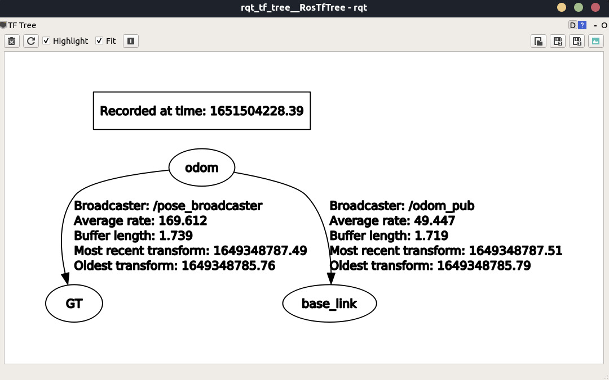
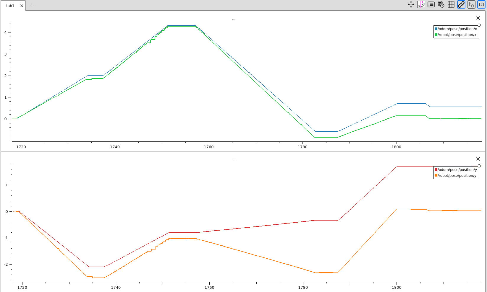
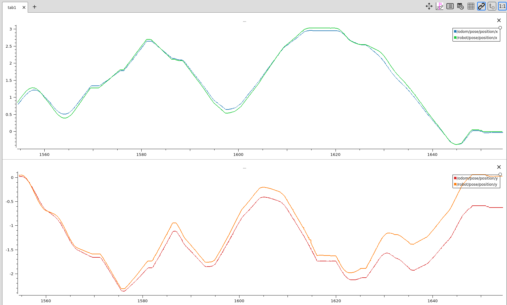
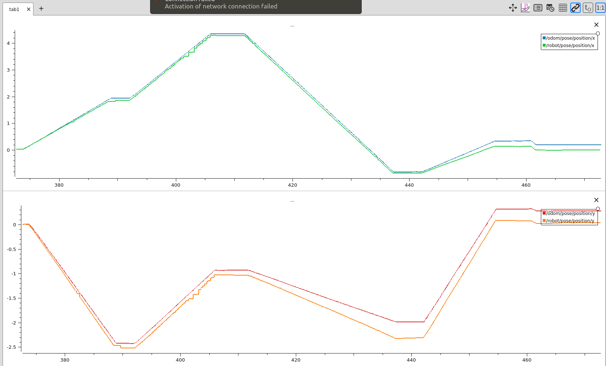
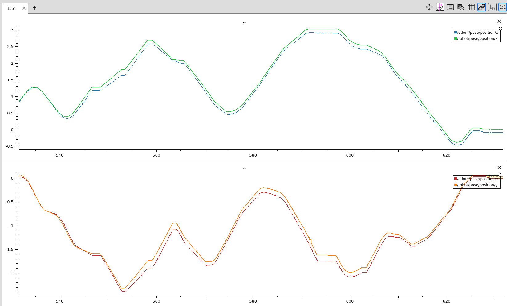

# Robotics - Project 1 2021/2022 

The first project requires to compute the odometry for an omnidirectional robot with four mecanum wheels.
<br />

## Group members (with person code):
- ###  [Gabriele Ginestroni](https://github.com/gabrieleginestroni) (10687747)
- ###  [Tommaso Capacci](https://github.com/TommasoCapacci) (10654230)

## Files
All of our code has been organized in a single package named _project1_. Inside this package we can find some subdirectories:

| Directory | Description                                                            |
|-----------|------------------------------------------------------------------------|
| bags      | ros bags provided with the project specification                       |
| cfg       | file used for dynamic reconfigure of the integration type parameter    |
| csv       | support files used as input of python script for parameter calibration |
| launch    | launch file to start the implemented nodes                             |
| msg       | custom messages definition files                                       |
| python    | script used for parameter calibration                                  |
| src       | source files of ros nodes                                              |
| srv       | odometry reset service declaration file                                |

## Instructions
To start the project type the following code:

- ##### start roscore :
  ```shell
   > roscore
  ```

- ##### compile project in a new shell :
  ```shell
   > cd path/to/your/catkin_workspace
   > catkin_make
  ```

- ##### launch project nodes :
  ```shell
   > roslaunch project1 launcher.launch
  ```
  
## Project description
- ### Kinematics
Being: <br/> 
N = ticks count per revolution <br/> 
T = gear ratio <br/>
r = wheels radius <br/>
l = wheels position along x axis <br/>
w = wheels position along y axis <br/>

  #### Wheels angular velocities:
  #### _from RPM)_ 
  &omega;<sub>rpm</sub> = <sup>1</sup>/<sub>(60 * T)</sub> * &omega;<sub>bags</sub>
  #### _from ticks)_ 
&omega;<sub>ticks</sub> = <sup>2&pi;</sup>/<sub>(N * T)</sub> * <sup>&Delta;Ticks</sup>/<sub>&Delta;Time</sub>
  #### Robot linear velocities:
  v<sub>x</sub> =  <sup>r</sup> / <sub>4</sub> * (&omega;<sub>fl</sub> + &omega;<sub>fr</sub> + &omega;<sub>rl</sub> + &omega;<sub>rr</sub>) <br/>
  v<sub>y</sub> = <sup>r</sup> / <sub>4</sub> * (&omega;<sub>fr</sub> - &omega;<sub>fl</sub> + &omega;<sub>rl</sub> - &omega;<sub>rr</sub>)
  #### Robot angular velocity
  &omega; = <sup>r</sup> / <sub>4</sub> * <sup>1</sup> / <sub>(l + w)</sub> * (&omega;<sub>fr</sub> + &omega;<sub>rr</sub> - &omega;<sub>fl</sub> - &omega;<sub>rl</sub>)
#### Inverse formulas:
  &omega;<sub>fl</sub> = <sup>(60 * T)</sup> / <sub>r</sub> * (v<sub>x</sub> - v<sub>y</sub> - &omega; * (l + w)) <br/>
  &omega;<sub>fr</sub> = <sup>(60 * T)</sup> / <sub>r</sub> * (v<sub>x</sub> + v<sub>y</sub> + &omega; * (l + w)) <br/>
  &omega;<sub>rl</sub> = <sup>(60 * T)</sup> / <sub>r</sub> * (v<sub>x</sub> + v<sub>y</sub> - &omega; * (l + w)) <br/>
  &omega;<sub>rr</sub> = <sup>(60 * T)</sup> / <sub>r</sub> * (v<sub>x</sub> - v<sub>y</sub> + &omega; * (l + w))

- ### Parameters:
We created some custom parameters inside the parameter server in order to use them to change some important aspects of the project without needing to recompile it.
These are:

| Parameter                    | Description                                                                      |
|------------------------------|----------------------------------------------------------------------------------|
| /initial_pose_x              | used to set the initial position along the x axis                                |
| /initial_pose_y              | used to set the initial position along the y axis                                |
| /initial_pose_theta          | used to set the initial yaw angle of the robot                                   |
| /N                           | counts per revolution value                                                      |
| /R                           | wheels radius value                                                              |
| /LW                          | (l + w) value                                                                    |
| /odom_pub/integration_method | used to set integration method (see [Dynamic reconfigure](#dynamic-reconfigure)) |

- ### Requested nodes
| Node      | Description                                                       |
|-----------|-------------------------------------------------------------------|
| /vel_pub  | computes base_link velocities starting from bags' data            |
| /odom_pub | computes robot odometry starting from base_link                   |
| /inverter | computes wheels angular speeds starting from base_link velocities |

- ### Support nodes
| Node              | Description                                                                                                                          |
|-------------------|--------------------------------------------------------------------------------------------------------------------------------------|
| /synchronizer     | synchronizes /robot/pose and /wheel_states messages and condenses their meaningful data in a custom message for calibration purposes |
| /pose_broadcaster | intercepts /robot/pose messages and changes their frame-id to "odom" and child-frame-id to "GT", allowing for visualization on rviz  |

- ### Topics
| Topic          | Message type               | Publisher      | Subscribers                          | Description                                                                 |
|----------------|----------------------------|----------------|--------------------------------------|-----------------------------------------------------------------------------|
| /cmd_vel       | geometry_msgs/TwistStamped | /vel_pub       | /odom_pub, /inverter, /synchronizer* | base_link linear and angular velocities                                     |
| /odom          | nav_msgs/Odometry          | /odom_pub      |                                      | global position computed by integrating base_link velocities                |
| /robot/pose    | geometry_msgs/PoseStamped  |                | /pose_broadcaster                    | ground truth (GT) pose measured with Optitrack system                       |
| /w_rpm         | project1/RpmStamped        | /vel_pub       |                                      | wheels angular speed computed from RPM [rad/s]                              |
| /w_ticks       | project1/RpmStamped        | /vel_pub       |                                      | wheels angular speed computed from TICKS [rad/s]                            |
| /wheel_states  | sensor_msgs/JointState     |                | /vel_pub, /synchronizer*             | angular speed [rad/min] and current encoder position for each wheel's motor |
| /wheels_rpm    | project1/RpmStamped        | /vel_pub       |                                      | wheels angular speed computed from robot's linear and angular velocities    |
| /pose_vel_sync | project1/PoseVelSync       | /synchronizer* |                                      | motors' angular speeds [rad/min] and robot pose (GT) synchronized           |

*Note: the provided launch file does not start the _synchronizer_ node, which has been used only for producing the calibration bag files
  
- ### Custom messages
| Name        | Structure                                                                                                              | Description                                                                                                                 |
|-------------|-----------------------------------------------------------------------------------------------------------------------------------------------------------|-----------------------------------------------------------------------------------------------------------------------------|
| PoseVelSync |  <br/> uint32 sec <br/> uint32 nsec <br/> float64 poseX <br/> float64 poseY <br/> float64 q_x <br/> float64 q_y<br/> float64 q_w <br/> float64 q_z <br/> float64 rpm_fl <br/> float64 rpm_fr <br/> float64 rpm_rl <br/> float64 rpm_rr <br/>   | used for calibration purposes, this message contains the ground truth pose and wheels' data, synchronized at each timestamp |
| RpmStamped  |  <br/> Header header <br/> float64 rpm_fl <br/> float64 rpm_fr <br/> float64 rpm_rr <br/> float64 rpm_rl <br/>                                                        | as requested from the project specification, this message is used to contain the */inverter* node results                   |

## Dynamic reconfigure
As requested, our project supports dynamic reconfigure on the integration method used by the _/odom_pub_ node. To fulfill this task we designed an enumeration with 2 values and used this to populate a parameter of the parameter server : depending on the stored value our node will use Euler's integration method (0, the default one) or the Runge-Kutta's one (1). <br/>
To try this feature we recommend using the _rqt_reconfigure_ tool, already shipped with ros. To do this type: 
 ```shell
   > rosrun rqt_reconfigure rqt_reconfigure
  ```
and a separate window will pop up.

## Odometry reset service
The project also provides a service that can be used to set the current pose (both position and orientation) at any point and yaw angle. Here's and 
example on how to use it:
```shell
   > rosservice call /reset_odom_to_pose "new_x: 0.0 new_y: 0.0 new_theta: 0.0"
  ```
where new_x is the requested position along the x axis, new_y the one along the y axis and new_theta the orientation measured w.r.t the positive direction of the x axis in radians. 
## TF

## Parameter Calibration
Since the provided ticks data from bags have much more noise than RPM data, we decided to split the calibration in two phases, to avoid any possible overfitting
to the ticks's noise.

  
 _Profile of a linear velocity (Vx) computed from RPM (left) vs the one computed from ticks_

|||
|--------------|---------------|
|_Performance on bag 2 with given parameters_| _Performance on bag 3 with given parameters_

We started by calibrating R and L+W parameters, computing in _calibration.py_ the odometry by integrating with Runge-Kutta the velocities
stored in the calibration csv files and picking parameters from reasonable and fully parametric intervals.
Then, residual sum of squares (RSS) with euclidean distance between optitrack measured position (x,y) and the position obtained by odometry has been used to evaluate the parameters.
Two separated calibrations have been performed, one on bag 2 and the other one on bag 3, to account for odometry errors caused by complex moves of the robot.
Among the two set of possible best parameters we picked the one with smaller RSS by cross-validating with respect to the two bags.

Second and last step of the calibration has been performed in the same way, but fixing R and L+W, estimating N by computing the odometry using ticks' data.

|||
|--------------|---------------|
|_Performance on bag 2 with estimated parameters_| _Performance on bag 3 with estimated parameters_

The 2-steps calibration turned out to be convenient even because R and N are strongly correlated in the speeds formulas, leading to a unique solution which would not be possible in case of 1-step calibration.